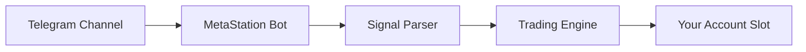

# Telegram-to-Trade

Telegram-to-Trade connects your Telegram account to MetaStation. Signals posted in Telegram channels are parsed automatically and executed as trades on your account.

---

## How it works



You link a Telegram channel to an account slot. When a signal is posted in that channel, MetaStation reads it, parses the action, and executes the trade.

---

## Requirements

- An account slot with automation enabled (MetaStation Account slot, or a paid Binance/ByBit/KuCoin slot subscription)
- A Telegram account
- Access to a signal channel (your own, or one you're subscribed to)

---

## Setup

### 1. Connect your Telegram account

{/* SCREENSHOT: tg-connect | Webhook Management -> Telegram Connection tab, phone-number state | 1440x900 | redact: phone number */}

1. Open **Webhook Management** in the sidebar and switch to the **Telegram Connection** tab
2. Enter your **phone number with country code** (e.g. `+1 234 567 8900`)
3. Click **Connect Telegram**
4. Telegram sends a verification code to your Telegram app — enter it under **Enter Verification Code**
5. If your *Telegram* account has its own two-step verification enabled, you are then asked for that **2FA password**. This is Telegram's password, not your MetaStation one

Once connected, the card shows your linked number, how many channels have been detected, and how
many are set to copy-trade or broadcast.

:::warning
Your Telegram session is stored encrypted, and MetaStation does not read your private messages.
Never share your Telegram login code with anyone — MetaStation support will never ask for it.
:::

### 2. Let MetaStation detect the channel

{/* SCREENSHOT: tg-channel-binding | connected state showing detected-channel counts + channel selector | 1440x900 | redact: channel names optional */}

Channels are **detected by forwarding**, not by typing a link:

1. Open the signal channel in Telegram
2. Forward any message from it to **@MetaStationBot**
3. It appears in MetaStation as a detected channel

### 3. Map the channel to an account slot

1. Open the account card for the slot you want to trade on
2. Pick the detected channel in its Telegram section
3. Choose whether it is a **copy-trade** source or a **broadcast** target
4. Configure risk controls (see below), then save

:::note Channel limit
Up to **3 signal channels per account**. Map different channels to different slots if you need
more than three sources in total.
:::

{/* SCREENSHOT: tg-parse-preview | signal parse preview showing parsed action/symbol/size | 1440x900 | redact: none */}

---

## Risk controls per channel

| Setting | Description |
|---|---|
| **Position size** | Fixed USD amount or % of wallet per signal |
| **Max leverage** | Cap leverage regardless of what the signal specifies |
| **Symbol whitelist** | Only execute signals for specific pairs |
| **Max open positions** | Stop executing new signals if you already have N open |

---

## Signal parsing

MetaStation's parser reads natural language signals and extracts:
- Action (Buy / Sell / Close / Update)
- Symbol (BTC, ETH, etc.)
- Direction (Long / Short)
- Entry price or "at market"
- Take Profit levels
- Stop Loss level
- Leverage (if specified)

**Example signal the parser handles:**

```
📈 LONG BTC/USDT
Entry: Market
TP1: 48000
TP2: 51000
SL: 41000
Leverage: 10x
```

If a signal is ambiguous or missing required fields, MetaStation logs a parse error and does not execute — it never guesses.

---

## Monitoring

Open **Webhook Management → Telegram Connection** to see:
- All received messages per channel
- Parse result (success / error)
- Execution status
- Trade details

Press **Refresh** on the connection card to re-read the current channel counts.

---

## Managing the connection

The same **Telegram Connection** tab shows your linked session. **Disconnect** ends it — signal
parsing stops immediately — and you can reconnect any time by repeating the phone-number flow.
