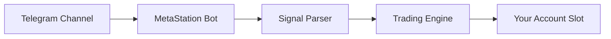

# Telegram-to-Trade

Telegram-to-Trade connects your Telegram account to MetaStation. Signals posted in Telegram channels are parsed automatically and executed as trades on your account.

---

## How it works



You link a Telegram channel to an account slot. When a signal is posted in that channel, MetaStation reads it, parses the action, and executes the trade.

---

## Requirements

- An account slot with automation enabled (MetaStation Account slot, or a paid Binance/ByBit/KuCoin slot subscription)
- A Telegram account
- Access to a signal channel (your own, or one you're subscribed to)

---

## Setup

### 1. Connect your Telegram account

1. Go to **Settings → Telegram-to-Trade**
2. Click **Connect Telegram**
3. You will be prompted to verify via a code sent to your Telegram app
4. Complete 2FA verification — this is required to protect your session

:::warning
Your Telegram session is stored securely and encrypted. Never share your Telegram login code with anyone. MetaStation support will never ask for it.
:::

### 2. Map a channel to an account slot

1. Once connected, click **Add Channel**
2. Enter the channel username or link
3. Select the account slot where signals from this channel will execute
4. Configure risk controls (see below)
5. Save

You can map multiple channels to different account slots.

---

## Risk controls per channel

| Setting | Description |
|---|---|
| **Position size** | Fixed USD amount or % of wallet per signal |
| **Max leverage** | Cap leverage regardless of what the signal specifies |
| **Symbol whitelist** | Only execute signals for specific pairs |
| **Max open positions** | Stop executing new signals if you already have N open |

---

## Signal parsing

MetaStation's parser reads natural language signals and extracts:
- Action (Buy / Sell / Close / Update)
- Symbol (BTC, ETH, etc.)
- Direction (Long / Short)
- Entry price or "at market"
- Take Profit levels
- Stop Loss level
- Leverage (if specified)

**Example signal the parser handles:**

```
📈 LONG BTC/USDT
Entry: Market
TP1: 48000
TP2: 51000
SL: 41000
Leverage: 10x
```

If a signal is ambiguous or missing required fields, MetaStation logs a parse error and does not execute — it never guesses.

---

## Monitoring

Go to **Settings → Telegram-to-Trade → Logs** to see:
- All received messages per channel
- Parse result (success / error)
- Execution status
- Trade details

---

## Managing sessions

Your Telegram session is shown in **Settings → Telegram-to-Trade → Session**. You can disconnect and reconnect at any time. Disconnecting stops all signal parsing immediately.
