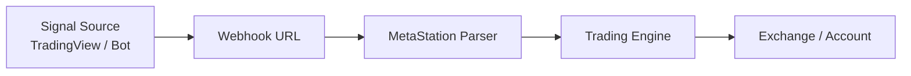

# Webhook Trading

Webhooks let external services — TradingView, custom bots, or any HTTP source — send trading signals to MetaStation for automatic execution.

---

## How it works



When your signal source fires an alert, it sends a POST request to your unique webhook URL. MetaStation parses the message and executes the trade on your selected account slot.

---

## Setup

### 1. Open Webhook Management

Click **Webhook Management** in the sidebar —
[metastation.fi/social-trade/webhook-management](https://metastation.fi/social-trade/webhook-management).
The page has two tabs — **Webhook URLs** and **Telegram Connection**. Stay on **Webhook URLs**;
its **Your Webhook URLs** section lists one webhook URL per account slot you can automate.

{/* SCREENSHOT: webhook-urls | Webhook Management -> Your Webhook URLs | 1440x900 | redact: WEBHOOK TOKEN (mandatory) */}
<Screenshot id="webhook-urls" />
<Screenshot id="webhook-urls" />
<Screenshot id="webhook-urls" />
{/* SCREENSHOT: regenerate-secret | Regenerate Secret confirm state | 1440x900 | redact: webhook token */}
<Screenshot id="regenerate-secret" />
<Screenshot id="regenerate-secret" />
<Screenshot id="regenerate-secret" />
:::tip[Build the payload instead of writing it]
The **[Webhook Payload Builder](/docs/developer/payload-builder)** generates a valid JSON payload,
a TradingView alert message and a ready-to-run `curl` command from a form — no hand-written JSON,
which is where most first attempts fail.
:::

:::note
Webhook automation is **included free** on your MetaStation Account slot. For Binance, ByBit, or KuCoin slots, a paid slot subscription is required.
:::

### 2. Copy your webhook URL

1. Find the account slot you want to automate under **Your Webhook URLs**
2. Copy its **Webhook URL** — it looks like:

```
https://metastation.fi/metastationapi/socialTrade/webhook/{your-webhook-secret}
```

3. Store it securely. Treat it like a password — anyone with this URL can execute trades on your account.
4. If it ever leaks, press **Regenerate Secret** on that slot. The old URL stops working immediately.

### 3. Configure security (optional but recommended)

- **IP Whitelist** — Restrict webhook to only accept signals from specific IPs (e.g., TradingView's server IPs)
- **Rate limit** — Set max signals per minute to prevent abuse

### 4. Send signals

Send POST requests to your webhook URL in [JSON format](/docs/developer/json-format) or [Natural Language format](/docs/developer/natural-language-format).

---

## Supported actions

| Action | Description |
|---|---|
| `open` | Open a new position |
| `close` | Close an existing position (full or partial) |
| `update` | Modify TP/SL on an existing position |
| `reverse` | Close current position and open the opposite |

---

## Viewing webhook history

Open **Webhook Management** to see all received signals, their parsed content, execution status, and any errors.

{/* SCREENSHOT: webhook-history | received-signal log with parse results | 1440x900 | redact: account ids */}
<Screenshot id="webhook-history" />
<Screenshot id="webhook-history" />
<Screenshot id="webhook-history" />

---

## Testing your webhook

Use a tool like Postman or curl to send a test signal:

```bash
curl -X POST https://metastation.fi/metastationapi/socialTrade/webhook/YOUR_SECRET \
  -H "Content-Type: application/json" \
  -d '{"action":"open","symbol":"BTCUSDC","side":"buy","orderType":"market","quantity":"1%"}'
```

Verify the trade appears in your account before going live.

---

→ [JSON Format Reference](/docs/developer/json-format)  
→ [Natural Language Format](/docs/developer/natural-language-format)  
→ [TradingView Setup](/docs/automation/tradingview-setup)
