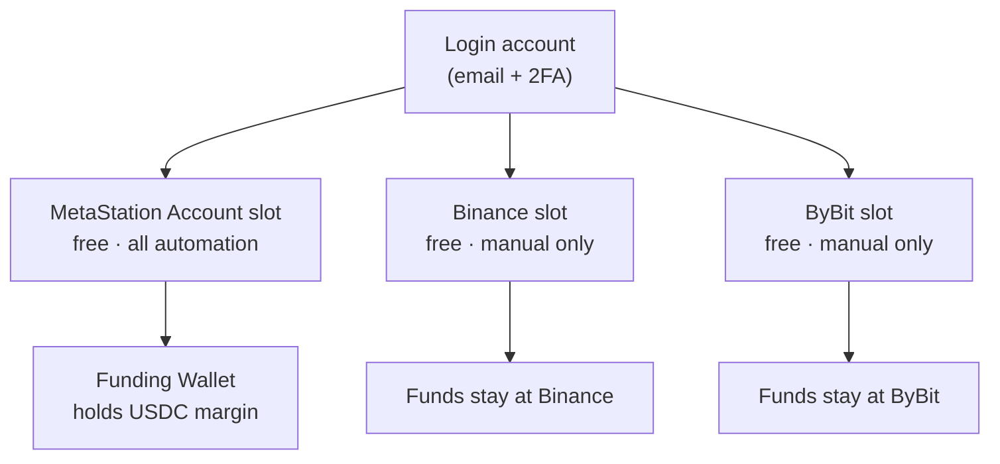

import ArticleSchema from '@site/src/components/ArticleSchema';
import FAQ from '@site/src/components/FAQ';

<ArticleSchema
  headline="The MetaStation Account Model — Accounts, Slots and Wallets"
  description="How MetaStation separates the login account, trading slots, and the Funding Wallet that holds funds."
  section="Concepts"
/>

# The Account Model

Three things in MetaStation are easy to confuse because everyday language calls all of them
"your account". They are separate, and almost every question about where money sits or why a
feature is unavailable resolves once the distinction is clear.

| Layer | What it is | How many |
|---|---|---|
| **Login account** | Your identity — email, password, 2FA. What you sign in with. | Exactly one |
| **Trading slot** | One trading configuration: a venue, its balance, its settings, its automation. | One or many |
| **Funding Wallet** | The smart-contract wallet holding the money behind a MetaStation Account slot. | One per MetaStation Account slot |

---

## The login account

One email, one password, one 2FA secret. It owns everything below it and is not itself a place
where money sits. Compromising it compromises every slot underneath, which is why 2FA is
required before a withdrawal can be made at all.

→ [Security Setup](/docs/getting-started/security-setup)

---

## Trading slots

A **slot** is the unit of trading configuration. Each one is independent: its own balance, its
own leverage defaults, its own automation rules, its own webhook URL. A signal sent to one
slot's webhook cannot touch another slot.

Slots come in two kinds, and the difference decides what a slot can do.

### MetaStation Account slots

Native to the platform, created for you at registration. **Web3 by default** — the slot settles
on-chain in USDC against an on-chain order book, with gas abstracted away so you never pay it.

Your first one is free and carries **every automation tool** at no cost.

### Connected exchange slots

Binance, ByBit and KuCoin, connected with API keys you generate at that exchange. MetaStation
holds the keys and places orders; the funds never leave the exchange. You get one free slot per
exchange, and it is **manual** — terminal trading and copy-trading as a follower, but no
webhooks and no Telegram-to-Trade until you buy a slot subscription from the Store.

**This is the single most important asymmetry in the product:** automation is free on the native
account and paid on connected exchanges. If you are evaluating MetaStation for webhook trading
and do not want a subscription, the MetaStation Account slot is the answer.

→ [Account Slots](/docs/trading/account-slots) · [Connect an Exchange](/docs/trading/connect-exchange)

---

## The Funding Wallet

Behind every MetaStation Account slot is a **Funding Wallet** — a smart-contract wallet created
for you on Arbitrum. It is where deposited value lands and where your USDC trading margin lives.

What that buys you:

- **No seed phrase.** The wallet is tied to your account rather than to a phrase you must store.
- **No gas token.** Gas on your trades is abstracted away, so you never hold ETH just to trade.
- **Not an omnibus balance.** Your funds sit in a wallet associated with you, not pooled into one
  exchange-wide account.

Deposits from other chains are bridged into it and converted to USDC automatically, so from your
side there is one destination regardless of what you sent or where you sent it from.

Connected exchange slots have **no** Funding Wallet. Their balance is your balance at that
exchange, and deposits and withdrawals for it happen at the exchange, not here.

→ [Funding & Settlement](/docs/concepts/funding-and-settlement)

---

## Why a feature is unavailable

Nearly every "why can't I do this?" traces back to which slot is selected:

| Symptom | Cause |
|---|---|
| No webhook URL for a slot | It is a free manual exchange slot. Automation needs a Store subscription |
| Telegram tab shows no slot to map | Same — the target slot has no automation entitlement |
| Deposit screen shows no address | A connected exchange slot is selected. Deposit at the exchange instead |
| Withdrawal blocked | 2FA is not set up. It is required, not optional |

<FAQ
  items={[
    {
      question: 'What is the difference between a MetaStation Account and a trading slot?',
      answer:
        'A MetaStation Account is one type of trading slot — the native, Web3 one created for you at registration. "Slot" is the general term for any single trading configuration, which may also be a connected Binance, ByBit or KuCoin account. Your login account can hold several slots of both kinds at once.',
    },
    {
      question: 'Do I need my own crypto wallet to use MetaStation?',
      answer:
        'No. A MetaStation Account slot comes with a Funding Wallet — a smart-contract wallet created for you automatically. There is no seed phrase to record and no gas token to hold, because gas on your trades is abstracted away.',
    },
    {
      question: 'Is webhook automation free on MetaStation?',
      answer:
        'It is free on your MetaStation Account slot, along with Telegram-to-Trade, copy trading and advanced orders. On a connected Binance, ByBit or KuCoin slot, automation requires a paid slot subscription from the Store; those slots are free for manual trading and for following copy-trading providers.',
    },
    {
      question: 'Where do my funds sit when I connect Binance to MetaStation?',
      answer:
        'They stay at Binance. Connecting an exchange means giving MetaStation API keys that let it place orders on your behalf — no funds move to MetaStation. Deposits and withdrawals for that slot are done at the exchange itself.',
    },
    {
      question: 'Can one webhook signal trade on several accounts at once?',
      answer:
        'No. Each slot has its own webhook URL, and a signal executes only on the slot whose URL received it. To trade the same signal on several slots, send it to each slot’s URL.',
    },
  ]}
/>
