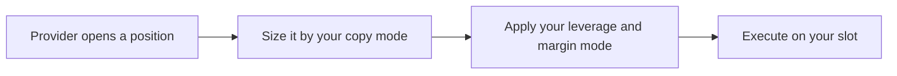

import ArticleSchema from '@site/src/components/ArticleSchema';
import FAQ from '@site/src/components/FAQ';

<ArticleSchema
  headline="How Copy Trading Executes on MetaStation"
  description="How a provider's trade is translated to your balance, which controls sit in the path, and why results never match exactly."
  section="Concepts"
/>

# How Copy Trading Executes

Copy trading looks like duplication. It is closer to **translation**: the provider's trade is
restated in the terms of your account, and a small number of settings you control change it on the
way.



That is the whole path. It is shorter than most people expect, and the things it does **not**
contain matter as much as the things it does.

---

## Both provider types execute the same way

MetaStation has two kinds of provider, and this is the one place the distinction does not apply.

- A **signal provider** trades an account they own and publishes signals from it.
- A **fund manager** trades a dedicated account the platform provisioned for them.

Downstream of the signal, nothing differs. The same copy modes, the same leverage and margin
controls, the same execution path onto your slot. What differs is how the provider is funded and
how they are paid.

→ [Fund Managers](/docs/social-trading/fund-managers)

---

## Sizing is set by your copy mode

There is no multiplier. Size is decided by which of **three copy modes** you chose when you
subscribed:

| Mode | What it does |
|---|---|
| **Copy Trader** | Mirrors the provider's position size exactly |
| **Fixed Ratio** | Takes a percentage of the provider's size — **0.01% to 100%** |
| **Fixed Amount** | Uses the same flat position size on every copied trade |

**Fixed Ratio cannot exceed 100%.** You cannot take a larger position than the provider did; a
value above 100 fails validation before the subscription is saved.

This is why `1.0x`-style thinking misleads. A provider trading a $100,000 account at $5,000 a
position is risking 5%. Mirrored into a $5,000 account with **Copy Trader**, that same $5,000
position is your entire balance. The ratio that reproduces their *risk* rather than their notional
is:

```
ratio % = (your balance / provider balance) × 100
```

A $2,000 account following a $20,000 provider is `10%`.

:::warning[Copy mode is fixed once you subscribe]
The mode is chosen at subscription and cannot be changed afterwards — the settings form ignores the
change on an existing subscription. Moving between modes means cancelling and subscribing again.
:::

→ [Copy Settings](/docs/social-trading/copy-settings)

---

## What sits between the provider and you

Two things, and they are both yours:

| Control | Effect |
|---|---|
| **Leverage** | 1× – 125×, applied to your copied position independently of the provider's |
| **Margin mode** | Isolated or Cross. Isolated confines a loss to that position's margin |

Leverage multiplies the position, not the edge. At 10× a copied trade needs a tenth of the margin
and moves ten times as fast against you.

If the provider trades on **ByBit**, you can also override their take profit and stop loss with
your own percentages. That override is not offered for providers trading a MetaStation Account.

---

## What is *not* in the path

This is the part worth reading twice, because the absent controls are exactly the ones people
assume are protecting them.

- **There is no automatic loss circuit breaker.** Nothing pauses copying after a drawdown. If a
  provider is losing, you pause or cancel the subscription yourself, from
  **My Subscriptions → Pause**.
- **There is no per-symbol filter.** Every symbol the provider trades is copied. If you do not want
  their altcoin trades, you do not want the provider.
- **There is no absolute per-trade cap.** Position size comes from your copy mode and nothing
  trims it afterwards.

The practical consequence: **your risk control is the copy mode, the leverage, and the size of the
allocation you gave the provider in the first place.** Those decisions are made before you
subscribe, and after that the only lever left is pausing.

:::note[Pausing does not close anything]
Existing copied positions stay open and remain yours to manage. Pausing stops new trades being
copied; it does not exit the ones you have.
:::

---

## Why your result will not match theirs

Published provider performance is the provider's own result. Yours differs, structurally, for
reasons that have nothing to do with the provider's skill:

- **Entry price.** Your order is placed after theirs. In a fast market that difference is real.
- **Your sizing.** A different copy mode is a different portfolio, not a scaled copy of theirs.
- **When you joined.** Positions already open when you subscribed are not retroactively copied, so
  you inherit the strategy mid-stream.
- **Fees and funding** accrue against your balance at your size.
- **Available margin.** A copied trade that would exceed what your slot can support does not open
  at full size.

A provider up 40% does not mean a follower is up 40%. It means the strategy was up 40% under their
sizing, their entries and their full trade sequence.

:::note[What is not copied]
Manual trades you place yourself are yours alone — they are not managed by the provider and are not
closed when the provider closes theirs. Keeping copied and manual trading on separate slots is the
cleanest way to keep the two accountings from blurring together.
:::

---

## Concentration is the risk that actually shows up

The failure mode in copy trading is rarely one bad trade. It is following several providers who all
take the same directional bet, so a single market move hits every position at once while the
portfolio looked diversified.

Practical guards, in descending order of usefulness:

1. Cap any single provider at a fraction of total capital — a common starting point is 30%.
2. Choose the copy mode and ratio deliberately, because it is the only sizing control you get.
3. Check whether providers overlap in symbols and direction, not just in headline returns.
4. Look at the subscription weekly, because nothing is going to do it for you.

<FAQ
  items={[
    {
      question: 'How is my copied position size decided?',
      answer:
        'By the copy mode you chose when subscribing. Copy Trader mirrors the provider’s size exactly, Fixed Ratio takes a percentage of their size between 0.01% and 100%, and Fixed Amount uses the same flat size on every trade. There is no multiplier and no setting that can take a larger position than the provider did.',
    },
    {
      question: 'What ratio should I use when copying a trader?',
      answer:
        'Start from your balance divided by the provider’s balance, expressed as a percentage. That reproduces their risk as a share of your account rather than their absolute position size. Mirroring a much larger account exactly can put your entire balance into a single trade that represented only a few percent for them.',
    },
    {
      question: 'Does copy trading stop automatically if a provider starts losing money?',
      answer:
        'No. There is no automatic loss threshold or circuit breaker. Copying continues until you pause or cancel the subscription yourself from My Subscriptions. Because of that, the allocation you give a provider and the copy mode you choose are the risk decisions, and they are made before you subscribe.',
    },
    {
      question: 'Can I stop a provider copying particular symbols to my account?',
      answer:
        'No. There is no per-symbol whitelist or blacklist. Every symbol the provider trades is copied to your account. If a provider trades markets you do not want exposure to, the decision is whether to follow that provider at all.',
    },
    {
      question: 'Is copying a fund manager different from copying a signal provider?',
      answer:
        'Not in execution. Both types reach your account through the same path, with the same three copy modes and the same leverage and margin controls. The differences are commercial and structural: a fund manager trades a dedicated account the platform provisioned and is paid a share of profits, while a signal provider trades their own account and charges a subscription fee or nothing.',
    },
    {
      question: 'Are my own manual trades affected by copy trading?',
      answer:
        'No. Trades you place yourself are not managed by the provider and are not closed when the provider closes theirs. Running copied and manual strategies on separate trading slots keeps the two sets of positions and their accounting cleanly apart.',
    },
    {
      question: 'Does copy trading open positions the provider already had?',
      answer:
        'No. Only trades the provider opens after you subscribe are copied. You join the strategy mid-stream, which is one reason a follower’s results diverge from the provider’s published performance.',
    },
  ]}
/>
