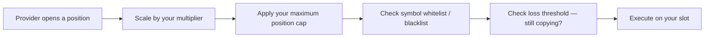

import ArticleSchema from '@site/src/components/ArticleSchema';
import FAQ from '@site/src/components/FAQ';

<ArticleSchema
  headline="How Copy Trading Executes on MetaStation"
  description="How a provider's trade is translated to your balance, what your limits override, and why results never match exactly."
  section="Concepts"
/>

# How Copy Trading Executes

Copy trading looks like duplication. It is closer to **translation**: the provider's trade is
restated in the terms of your account, and several things you control can change it on the way.



---

## Sizing is proportional, not identical

The **position size multiplier** scales every copied trade relative to the provider's.

| Multiplier | Effect |
|---|---|
| `1.0x` | The same size the provider took |
| `0.5x` | Half |
| `2.0x` | Double |

`1.0x` is rarely what you want, because it takes no account of the difference in balances. A
provider trading a $100,000 account at $5,000 a position is risking 5%. Copied at `1.0x` into a
$5,000 account, that same $5,000 position is your entire balance.

The multiplier that reproduces the provider's *risk* rather than their notional is:

```
multiplier = your_balance / provider_balance
```

That is the number to start from, and then scale down if you want less exposure than they take.

---

## Your limits override the provider

Four controls sit between the provider's trade and yours. Each can change or block it.

| Control | What it does when it binds |
|---|---|
| **Maximum position size** | Caps the position in absolute terms. A $5,000 copied trade against a $2,000 cap opens at $2,000 |
| **Symbol whitelist** | Only listed symbols are copied. Everything else is skipped entirely |
| **Symbol blacklist** | Listed symbols are skipped; the rest are copied |
| **Stop copying at loss threshold** | Copying pauses once your realised loss from this provider passes your limit |

The loss threshold is the one worth setting before you need it. It is a circuit breaker: it stops
new trades being copied after a defined drawdown and waits for you to decide, rather than
following a provider all the way down a bad run. It **pauses** copying — resuming is a manual
decision, deliberately.

→ [Copy Settings](/docs/social-trading/copy-settings)

---

## Why your result will not match theirs

Published provider performance is the provider's own result. Yours differs, structurally, for
reasons that have nothing to do with the provider's skill:

- **Entry price.** Your order is placed after theirs. In a fast market that difference is real.
- **Your caps.** Every trade the cap trimmed, and every symbol the whitelist skipped, is a
  different portfolio from theirs.
- **When you joined.** Positions already open when you subscribed are not retroactively copied,
  so you inherit the strategy mid-stream.
- **Fees and funding** accrue against your balance at your size.
- **Available margin.** A copied trade that would exceed what your slot can support does not open
  at full size.

A provider up 40% does not mean a follower is up 40%. It means the strategy was up 40% under
their sizing, their entries and their full trade sequence.

:::note[What is not copied]
Manual trades you place yourself are yours alone — they are not managed by the provider and are
not closed when the provider closes theirs. Keeping copied and manual trading on separate slots
is the cleanest way to keep the two accountings from blurring together.
:::

---

## Concentration is the risk that actually shows up

The failure mode in copy trading is rarely one bad trade. It is following several providers who
all take the same directional bet, so a single market move hits every position at once while the
portfolio looked diversified.

Practical guards, in descending order of usefulness:

1. Cap any single provider at a fraction of total capital — a common starting point is 30%.
2. Set the loss threshold *before* subscribing, not after a drawdown.
3. Cap individual positions at 5–10% of balance.
4. Check whether providers overlap in symbols and direction, not just in headline returns.

<FAQ
  items={[
    {
      question: 'What multiplier should I use for copy trading?',
      answer:
        'Start from your balance divided by the provider’s balance. That reproduces their risk as a percentage of your account rather than their absolute position size. Copying at 1.0x from a much larger account can put your entire balance into a single trade that represented a small percentage for them.',
    },
    {
      question: 'Why is my copy trading result different from the provider’s published performance?',
      answer:
        'Several structural reasons: your entry price differs because your order follows theirs, your position caps and symbol filters change which trades you take and at what size, positions already open when you subscribed are not copied retroactively, and fees and funding accrue at your own size. Published performance is the provider’s own result, not a forecast of yours.',
    },
    {
      question: 'What happens if a copied provider starts losing money?',
      answer:
        'If you set a stop-copying loss threshold, copying pauses automatically once your realised loss from that provider passes it, and no further trades are copied until you resume manually. Without a threshold set, copying continues regardless of drawdown, so it is worth configuring before you subscribe rather than during a losing run.',
    },
    {
      question: 'Are my own manual trades affected by copy trading?',
      answer:
        'No. Trades you place yourself are not managed by the provider and are not closed when the provider closes theirs. Running copied and manual strategies on separate trading slots keeps the two sets of positions and their accounting cleanly apart.',
    },
    {
      question: 'Does copy trading open positions the provider already had?',
      answer:
        'No. Only trades the provider opens after you subscribe are copied. You join the strategy mid-stream, which is one reason a follower’s results diverge from the provider’s published performance.',
    },
  ]}
/>
