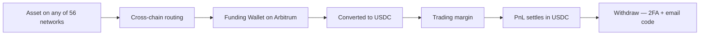

import ArticleSchema from '@site/src/components/ArticleSchema';
import FAQ from '@site/src/components/FAQ';

<ArticleSchema
  headline="Funding and Settlement on MetaStation"
  description="Bridging, the Funding Wallet, USDC as margin, how profit and loss settle, and why withdrawals are gated hardest."
  section="Concepts"
/>

# Funding and Settlement

Money entering a MetaStation Account takes one path regardless of which chain or asset it started
as. Following it end to end explains both the convenience and the one place where waiting is
normal.

---

## One destination, many origins

You can send from **56 blockchain networks** — Ethereum, Arbitrum, Optimism, Base, Polygon, BNB Smart
Chain, Avalanche, Solana, TRON, TON and more, both EVM and non-EVM — holding whatever asset you
already have. Bridging and conversion happen for you, and the result is USDC in your Funding
Wallet.

The practical consequence is that you do not need to acquire a specific asset on a specific chain
before you can start. Whatever you hold, wherever it is, is fundable.

→ [Cross-Chain Exchange — all 56 networks](/docs/wallet/cross-chain-exchange) · [Fund Your Account](/docs/getting-started/fund-account)

---

## The Funding Wallet

A smart-contract wallet on Arbitrum, created with your MetaStation Account. It holds the USDC
that backs your trading.

Three properties follow from it being a smart-contract wallet rather than a key you manage:

- **No seed phrase.** Access is tied to your MetaStation login, so account security *is* wallet
  security. This is precisely why 2FA is not optional for withdrawals.
- **No gas token.** Gas on your trades is abstracted away — you never hold ETH just to place an
  order, and a trade cannot fail because you were short of gas.
- **Not pooled.** Your balance sits in a wallet associated with your account rather than in one
  omnibus balance shared across all users.

---

## USDC as the unit of account

Everything settles in USDC. Margin is USDC, profit and loss are USDC, fees are USDC.

That single choice removes a whole category of confusion. There is no separate collateral asset
whose price movement quietly changes your margin health while a position is open, and no
conversion step between closing a trade and knowing what it made. A position closed at +$180 adds
$180 to the balance.

For perpetual futures, funding payments also settle in USDC and accrue against the position while
it is open — a cost of holding, independent of whether price moved your way.

---

## Deposits take as long as the chain does

The step that takes time is the bridge, and the variable is the source network, not MetaStation.
A deposit is not lost while it is in transit; it is confirming.

If a deposit has not appeared:

1. Confirm the transaction is finalised on the **source** chain — that is where the wait is.
2. Confirm you sent the asset and network you selected in the deposit screen. Sending a different
   asset, or the right asset on a different chain, is the common cause of a deposit that never
   arrives.
3. Check the deposit screen for status before contacting support.

---

## Withdrawals are gated hardest, on purpose

A withdrawal is the only action that moves value off the platform irreversibly, so it requires
**two independent codes from two separate channels**:

1. Your **Google Authenticator** code — something generated on your device.
2. A code emailed to your **registered address** — something delivered to an account you control.

An attacker with your password alone has neither. One with your password *and* your phone still
needs your email.

This also means 2FA must be set up before your first withdrawal — not as a recommendation, but as
a hard requirement. Setting it up when you are already trying to withdraw is the worst time.

→ [Withdrawal Security](/docs/security/withdrawal-whitelist) · [Two-Factor Authentication](/docs/security/two-factor-auth)

:::note Connected exchange slots work differently
Everything above describes a MetaStation Account slot. A connected Binance, ByBit or KuCoin slot
has no Funding Wallet — the funds are your balance at that exchange, and deposits and withdrawals
for it happen there, under that exchange's own rules.
:::

<FAQ
  items={[
    {
      question: 'Which blockchains can I deposit from on MetaStation?',
      answer:
        '56 blockchain networks, both EVM and non-EVM — including Ethereum, Arbitrum, Optimism, Base, Polygon, BNB Chain, Avalanche, Solana, Bitcoin, Tron, TON and XRP Ledger. Whatever asset you send is bridged and converted to USDC and credited to your Funding Wallet automatically, so you do not need to acquire a specific token on a specific chain first.',
    },
    {
      question: 'Do I need ETH for gas to trade on MetaStation?',
      answer:
        'No. The MetaStation Account is gasless by design — gas on your orders is abstracted away, so you never hold a separate gas token and a trade cannot fail because you were short of it.',
    },
    {
      question: 'Why has my deposit not arrived yet?',
      answer:
        'The waiting step is the source chain, not MetaStation. Confirm the transaction is finalised on the network you sent from, and confirm you sent the asset and network you selected on the deposit screen — sending the right asset on a different chain is the most common cause of a deposit that does not appear.',
    },
    {
      question: 'What do I need to withdraw funds from MetaStation?',
      answer:
        'Two independent codes: your Google Authenticator code and a code emailed to your registered address. Both are required for every withdrawal, which means two-factor authentication must be set up before your first one — it is a hard requirement rather than a recommendation.',
    },
    {
      question: 'Do I get a seed phrase for my MetaStation Funding Wallet?',
      answer:
        'No. The Funding Wallet is a smart-contract wallet on Arbitrum tied to your MetaStation account rather than to a phrase you store, so there is nothing to write down or lose. The trade-off is that your account security is your wallet security, which is why two-factor authentication is required to withdraw.',
    },
  ]}
/>
