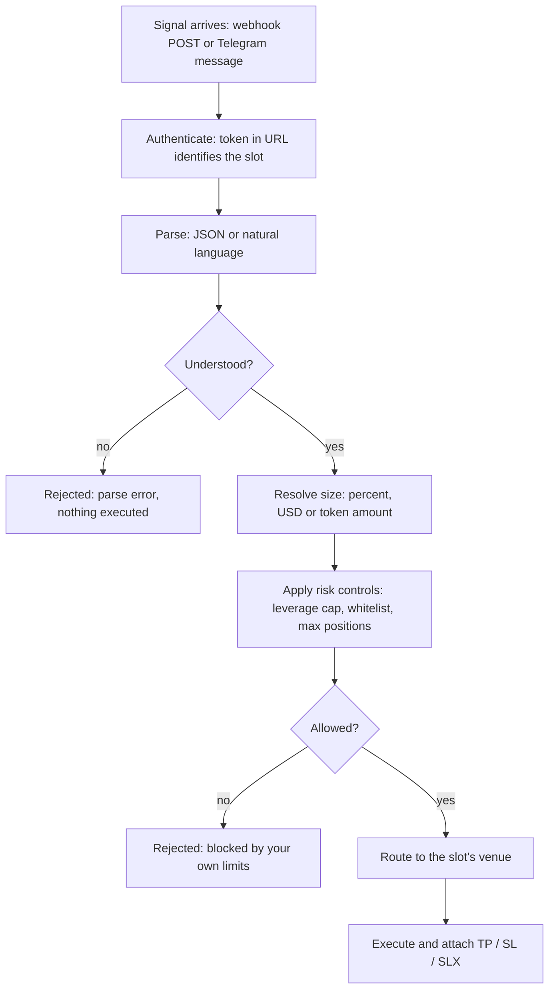

import ArticleSchema from '@site/src/components/ArticleSchema';
import FAQ from '@site/src/components/FAQ';

<ArticleSchema
  headline="How a Signal Becomes a Trade on MetaStation"
  description="The path a webhook or Telegram signal takes from arrival to fill, and every point at which it can be rejected."
  section="Concepts"
/>

# How a Signal Becomes a Trade

Every automated trade on MetaStation — whether it arrives from a TradingView alert, a Telegram
channel, or your own script — travels the same path. Understanding it tells you exactly where to
look when a signal does not do what you expected.



---

## 1. Arrival and authentication

A webhook signal is a `POST` to a URL that ends in a token unique to one slot:

```
https://api.metastation.fi/webhook/{your-unique-token}
```

**The token is the credential, and it is the whole credential.** There is no separate API key or
signature — anyone holding that URL can trade the slot it belongs to. That is why it should be
treated exactly like a password, and why regenerating the secret immediately invalidates the old
URL.

The token also determines *which slot* trades. There is no account field in the payload; routing
is entirely a function of which URL received the request.

A Telegram signal authenticates differently: the channel is bound to a slot in advance, so the
binding rather than a token decides where it executes.

→ [Secure Your Webhook](/docs/guides/secure-your-webhook)

## 2. Parsing

Two formats are accepted on the same endpoint, and the parser detects which one it is looking at.

**JSON** is explicit and unambiguous — the right choice for anything you generate yourself:

```json
{ "action": "open", "symbol": "BTCUSDC", "side": "buy", "quantity": "2%" }
```

**Natural language** is for signals written by humans, which is what Telegram channels and
hand-written TradingView alerts actually contain:

```
LONG BTC/USDT
Entry: Market
TP1: 48000
SL: 41000
```

From either form, the parser extracts action, symbol, direction, size, entry, take-profit levels,
stop loss and leverage.

:::note It never guesses
If a signal is ambiguous or missing a required field, MetaStation logs a parse error and executes
nothing. This is deliberate: a wrong trade is far more expensive than a missed one, and a parser
that fills in blanks would eventually fill one in wrongly with real money.
:::

→ [JSON Format](/docs/developer/json-format) · [Natural Language Format](/docs/developer/natural-language-format)

## 3. Size resolution

Size can be expressed three ways, and they behave differently as your balance changes:

| Form | Example | Resolves to |
|---|---|---|
| Percentage | `"2%"` | 2% of the slot's wallet balance **at the moment the signal arrives** |
| USD value | `"300 USD"` or `"$300"` | $300 of notional |
| Token amount | `0.001` or `"0.001 BTC"` | Exactly that many tokens |

The percentage form is the one that surprises people: it compounds. A `2%` strategy takes larger
positions as the account grows and smaller ones as it shrinks, without any change to the alert.
A fixed USD amount does not.

## 4. Risk controls

Before anything is routed, the signal is checked against limits **you** configured on the slot or
channel — maximum leverage, symbol whitelist, maximum open positions, per-signal position size.

These override the signal. A channel capped at 5x leverage executes a `20x` signal at 5x, and a
symbol outside the whitelist is skipped entirely rather than executed smaller.

→ [Risk Controls](/docs/concepts/risk-controls)

## 5. Routing and execution

The order is placed on whatever venue backs the slot — the on-chain order book for a MetaStation
Account, or Binance / ByBit / KuCoin through your API keys for a connected slot.

Any take-profit levels, stop loss, or SLX configuration in the signal are attached as part of the
same operation, so a position is never briefly open without its protection.

→ [Order Execution](/docs/concepts/order-execution)

---

## When a signal does nothing

Work down this list in order — it matches the pipeline above, so the first failing step is the
answer:

| Check | Meaning |
|---|---|
| Does the signal appear in **Webhook Management** at all? | If not, it never arrived. Look at the sender, the URL, and any IP whitelist you set |
| Does it show a **parse error**? | The format was not understood. Compare against the format reference |
| Did it parse but not execute? | A risk control blocked it — leverage cap, whitelist, or max open positions |
| Did it execute at the wrong size? | Check which size form the signal used, and the per-channel position-size setting |

{/* SCREENSHOT: signal-trace | Webhook Management log showing one signal with its parse result and execution status | 1440x900 | redact: account ids, webhook token */}

<FAQ
  items={[
    {
      question: 'Why did my TradingView alert not execute a trade?',
      answer:
        'Check the Webhook Management log in MetaStation first. If the signal is not listed, it never arrived — verify the alert’s webhook URL and any IP whitelist. If it is listed with a parse error, the message body was not understood. If it parsed but did not execute, one of your own risk controls blocked it: a leverage cap, a symbol whitelist, or a maximum open positions limit.',
    },
    {
      question: 'Does MetaStation guess missing values in a trading signal?',
      answer:
        'No. If a signal is ambiguous or missing a required field, MetaStation logs a parse error and executes nothing. Silently filling in a missing side, symbol or size would eventually produce a wrong trade with real money, so the parser refuses instead.',
    },
    {
      question: 'What does a quantity of 2% mean in a webhook signal?',
      answer:
        'It means 2% of that slot’s wallet balance, calculated at the moment the signal arrives. It compounds — the same alert takes larger positions as the account grows and smaller ones as it shrinks. Use a fixed USD amount such as "300 USD" instead if you want constant position sizing.',
    },
    {
      question: 'How does MetaStation know which account a webhook signal should trade?',
      answer:
        'From the URL. Each trading slot has its own webhook URL ending in a unique token, and the signal executes on the slot that owns the URL it was sent to. The payload contains no account field.',
    },
    {
      question: 'Can I send trading signals in plain English instead of JSON?',
      answer:
        'Yes. The same webhook endpoint accepts natural-language signals of the kind Telegram channels post — action, symbol, entry, take-profit levels, stop loss and leverage are extracted from the text. JSON is better for signals you generate programmatically because it is unambiguous.',
    },
  ]}
/>
